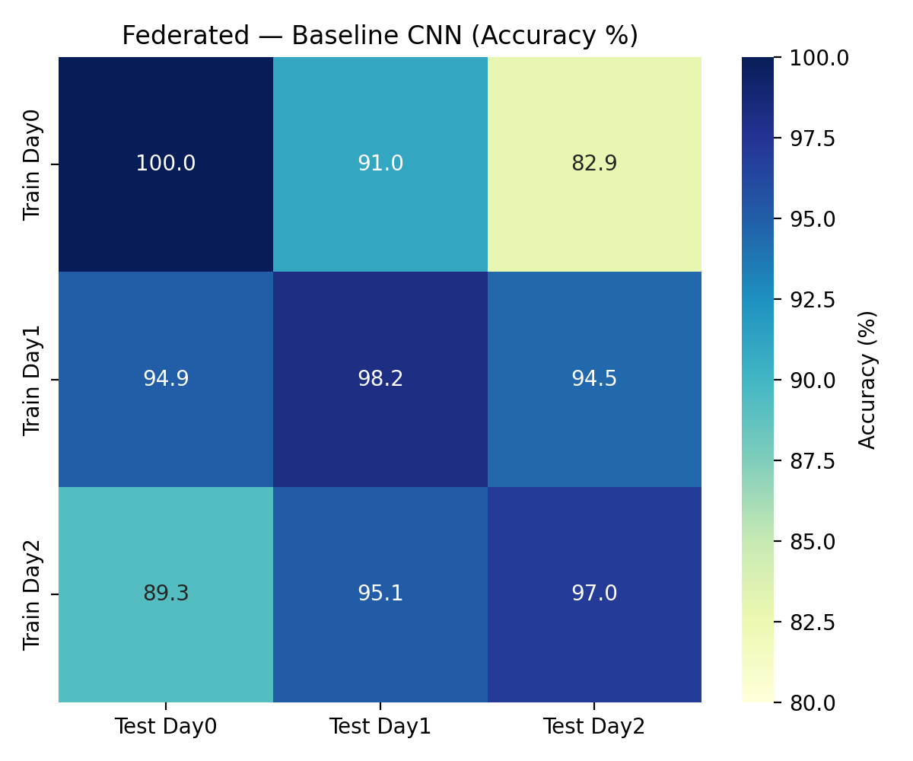
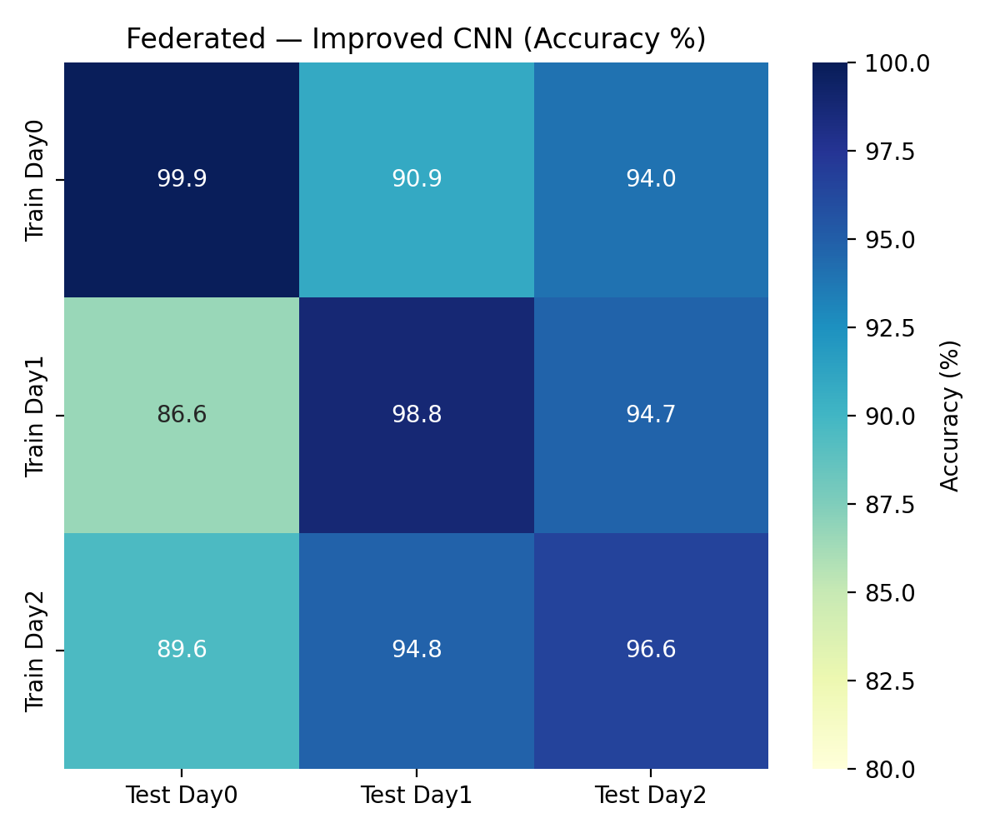
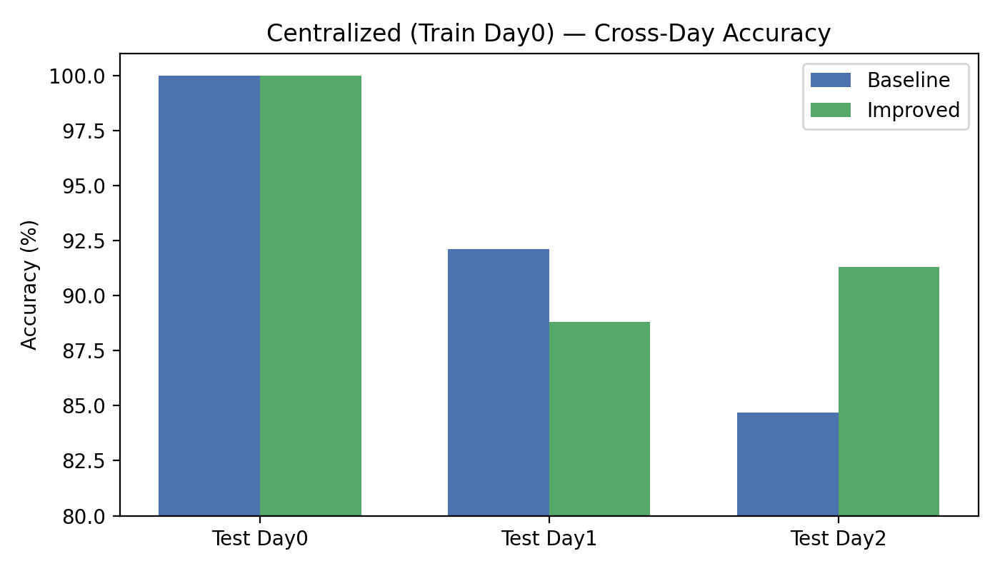

# mmWave MIMO Radar Human-Robot Positioning with Federated Learning

## EE 6770: Applications of Neural Networks (Fall 2025)

TensorFlow/Keras implementation of CNN-based human-robot distance and DOA classification using mmWave MIMO radar data. Implements both centralized and federated learning (FedAvg) with comprehensive safety-aware evaluation and cross-day robustness analysis.

[](https://www.python.org/downloads/)
[](https://www.tensorflow.org/)
[](https://opensource.org/licenses/MIT)

---

## Table of Contents

- [Overview](#overview)
- [Features](#features)
- [Dataset](#dataset)
- [Installation](#installation)
- [Quick Start](#quick-start)
- [Project Structure](#project-structure)
- [Usage](#usage)
    - [Detailed Usage Guide](docs/usage.md)
    - [Centralized Training](#centralized-training)
    - [Federated Learning](#federated-learning)
    - [Cross-Day Robustness](#cross-day-robustness)
    - [Running All Experiments](#running-all-experiments)
- [Model Architectures](#model-architectures)
- [Evaluation](#evaluation)
- [Results](#results)
- [Future Enhancements](#future-enhancements)
- [Contributing](#contributing)
- [License](#license)
- [References](#references)

---

## Overview

This project implements and compares centralized vs. federated learning for 10-class human position classification from mmWave MIMO radar range-azimuth maps. The system is designed for human-robot collaboration scenarios where:

- **Privacy is critical**: Radar-based sensing (no cameras)
- **Data is distributed**: Multiple radar devices across factory floor
- **Safety matters**: Special attention to critical misclassifications (near-robot predicted as empty)

**Key contributions:**

1. **Two CNN architectures** (baseline and improved) optimized for 256×63 range-azimuth maps
2. **Federated Learning implementation** using FedAvg with weighted aggregation by client dataset size
3. **Safety-aware evaluation** with critical error detection (near/mid/far/empty grouping)
4. **Cross-day robustness analysis** to measure domain shift across temporal conditions
5. **Reproducible experiment scripts** with pinned configurations for all experiments

---

## Features

- ✅ **Centralized training** with train/val split, early stopping, and LR scheduling
- ✅ **Federated learning** (FedAvg) with device-as-client partitioning
- ✅ **Two CNN models**: baseline (2 conv blocks) and improved (3 conv blocks + BatchNorm)
- ✅ **Comprehensive evaluation**: confusion matrices, per-class metrics, training curves
- ✅ **Safety-aware analysis**: group classes into near/mid/far/empty, detect critical errors
- ✅ **Cross-day robustness**: train on one day, test on others (domain shift analysis)
- ✅ **Reproducible scripts**: PowerShell automation for all experiments
- ✅ **Flexible normalization**: zscore, minmax, or log1p per-sample preprocessing

---

## Dataset

**Source:** [IEEE DataPort - Federated Learning: mmWave MIMO Radar Dataset for Testing](https://ieee-dataport.org/open-access/federated-learning-mmwave-mimo-radar-dataset-testing)

**Authors:** S. Savazzi, M. Nicoli, et al.

**Structure:**

```text
data/
├── day0/
│   ├── train_data/
│   │   ├── mmwave_data_train_1.mat  # Device 1
│   │   ├── mmwave_data_train_2.mat  # Device 2
│   │   └── ...                       # Devices 3-9
│   └── test_data/
│       └── mmwave_data_test.mat
├── day1/ (same structure)
└── day2/ (same structure)
```

**Data format:**

- **Input shape**: 256×63 (range bins × azimuth bins)
- **Range coverage**: ~0.5 m to 11 m
- **Azimuth coverage**: ~-75° to +75°
- **Classes**: 10 (class 0 = empty workspace, classes 1-9 = human in specific distance/angle regions)
- **Devices per day**: 9 (enables federated learning with 9 clients)

**Download:** Access the dataset at [IEEE DataPort](https://ieee-dataport.org/open-access/federated-learning-mmwave-mimo-radar-dataset-testing) and place `.mat` files in the structure shown above.

---

## Installation

### Prerequisites

- Python 3.10+
- Windows (PowerShell scripts) or Linux/macOS (adapt scripts)
- ~5 GB disk space for dataset and outputs

### Setup

1. **Clone the repository:**

   ```powershell
   git clone https://github.com/hmolhem/mmwave-mimo-fl-tf.git
   cd mmwave-mimo-fl-tf
   ```

2. **Create virtual environment:**

   ```powershell
   python -m venv .venv
   .\.venv\Scripts\Activate.ps1
   ```

3. **Install dependencies:**

   ```powershell
   pip install -r requirements.txt
   ```

4. **Download and place dataset:**

   - Download `.mat` files from [IEEE DataPort](https://ieee-dataport.org/open-access/federated-learning-mmwave-mimo-radar-dataset-testing)
   - Place in `data/day{0,1,2}/train_data/` and `data/day{0,1,2}/test_data/`
   - See `data/README.md` for expected structure

---

## Quick Start

### Run All Experiments (Centralized + Federated + Cross-Day)

```powershell
.\scripts\run_all_experiments.ps1
```

This will:

1. Train baseline and improved models on all 3 days (centralized)
2. Run federated learning with 9 clients per day
3. Perform cross-day robustness analysis
4. Generate comprehensive evaluation reports

**Estimated time:** 2-4 hours (hardware dependent)

### Run Single Centralized Experiment

```powershell
python src/train_centralized.py --day 0 --model baseline --epochs 50
```

### Run Single Federated Experiment

```powershell
python src/train_federated.py --day 0 --model baseline --rounds 20
```

---

## Project Structure

```text
mmwave-mimo-fl-tf/
├── data/                          # Dataset (gitignored except README)
│   ├── README.md                  # Dataset structure documentation
│   └── day{0,1,2}/               # Training days
├── src/                           # Source code
│   ├── data_loading.py            # Data loaders and preprocessing
│   ├── models.py                  # CNN architectures
│   ├── train_centralized.py      # Centralized training CLI
│   ├── train_federated.py         # Federated learning CLI
│   ├── federated.py               # FedAvg server implementation
│   ├── evaluation.py              # Evaluation utilities
│   ├── cross_day_robustness.py    # Cross-day experiments
│   └── aggregate_cross_day.py     # Cross-day analysis
├── scripts/                       # Reproducible experiment scripts
│   ├── README.md                  # Script documentation
│   ├── run_centralized_experiments.ps1
│   ├── run_federated_experiments.ps1
│   ├── run_cross_day_experiments.ps1
│   └── run_all_experiments.ps1
├── docs/                          # Documentation
│   └── proposal.md                # Project proposal
├── notebooks/                     # Jupyter notebooks (optional EDA)
├── outputs/                       # Experiment results (created on first run)
├── requirements.txt               # Python dependencies
└── README.md                      # This file
```

---

## Usage

### Centralized Training

Train a model on a single day's data (all devices merged):

```powershell
python src/train_centralized.py `
    --day 0 `
    --model baseline `
    --epochs 50 `
    --batch_size 32 `
    --lr 0.001 `
    --dropout 0.3 `
    --normalize zscore `
    --val_ratio 0.2 `
    --patience 10 `
    --seed 42 `
    --output_dir outputs/centralized/day0_baseline
```

**Outputs:**

- `best_model.keras` - Trained model checkpoint
- `config.json` - Training configuration
- `training_history.json` - Loss/accuracy curves
- `test_metrics.json` - Test set results
- `evaluation_report/` - Confusion matrices, per-class metrics, plots

### Federated Learning

Run FedAvg with 9 clients (devices) on a single day:

```powershell
python src/train_federated.py `
    --day 0 `
    --model baseline `
    --rounds 20 `
    --local_epochs 5 `
    --batch_size 32 `
    --lr 0.001 `
    --dropout 0.3 `
    --normalize zscore `
    --patience 5 `
    --seed 42 `
    --output_dir outputs/federated/day0_baseline
```

**Outputs:**

- `global_model.keras` - Final global model
- `config.json` - FL configuration
- `federated_history.json` - Round-by-round metrics
- `test_metrics.json` - Final test results
- `evaluation_report/` - Full evaluation

### Cross-Day Domain Shift

Train on one day, test on all days to measure domain shift:

```powershell
python src/cross_day_robustness.py `
    --train_day 0 `
    --model baseline `
    --epochs 50 `
    --output_dir outputs/cross_day
```

**Outputs:**

- Individual test results for each day
- Cross-day accuracy matrix
- Domain shift metrics (in-domain vs. out-of-domain accuracy)

**Aggregate results:**

```powershell
python src/aggregate_cross_day.py `
    --input_dir outputs/cross_day `
    --output_dir outputs/cross_day_summary
```

Generates heatmaps and summary statistics for all cross-day experiments.

### Running All Experiments

Use the master script to run all experiments sequentially:

```powershell
# Run everything
.\scripts\run_all_experiments.ps1

# Run only federated experiments
.\scripts\run_all_experiments.ps1 -SkipCentralized -SkipCrossDay

# Custom seed
.\scripts\run_all_experiments.ps1 -Seed 123
```

See `scripts/README.md` for detailed script documentation.
\nFor complete CLI argument reference and advanced workflows see the [Detailed Usage Guide](docs/usage.md).

---

## Model Architectures

### Baseline CNN

Compact architecture optimized for edge deployment:

```text
Input: (256, 63, 1)
├─ Conv2D(16, 3×3, same) → ReLU → MaxPool(2×2)
├─ Conv2D(32, 3×3, same) → ReLU → MaxPool(2×2)
├─ Flatten
├─ Dense(128) → ReLU → Dropout(0.3)
└─ Dense(10) → Softmax
```

**Parameters:** ~140K

### Improved CNN

Deeper architecture with batch normalization:

```text
Input: (256, 63, 1)
├─ Conv2D(16, 3×3, same) → BatchNorm → ReLU → MaxPool(2×2)
├─ Conv2D(32, 3×3, same) → BatchNorm → ReLU → MaxPool(2×2)
├─ Conv2D(64, 3×3, same) → BatchNorm → ReLU → MaxPool(2×2)
├─ Flatten
├─ Dense(256) → ReLU → Dropout(0.3)
└─ Dense(10) → Softmax
```

**Parameters:** ~350K

Both models use:

- **Optimizer:** Adam with initial LR = 0.001
- **Loss:** Sparse categorical crossentropy
- **Callbacks:** EarlyStopping, ReduceLROnPlateau, ModelCheckpoint

---

## Evaluation

### Standard Metrics

- **Overall accuracy**: Top-1 classification accuracy
- **Per-class metrics**: Precision, recall, F1-score for each class
- **Confusion matrix**: Raw counts and normalized probabilities
- **Training curves**: Loss and accuracy over epochs/rounds

### Safety-Aware Analysis

Classes are grouped into safety-critical regions:

- **Empty** (class 0): No human in workspace
- **Near** (class 2): 0.3-0.5 m from robot (critical zone)
- **Mid** (classes 1, 3, 4, 5): 0.5-1.0 m range
- **Far** (classes 6, 7, 8, 9): >1.0 m range

**Critical errors detected:**

- Near → Empty: Human near robot predicted as empty (most dangerous)
- Mid → Empty: Human in mid-range predicted as empty

### Cross-Day Robustness

- **In-domain accuracy**: Train and test on same day (diagonal of confusion matrix)
- **Out-of-domain accuracy**: Train on one day, test on different day
- **Domain shift gap**: In-domain - Out-of-domain accuracy

---

## Results

Quick link: see the full report in [docs/results.md](docs/results.md).

Summary (Train on Day0):

- Baseline CNN → Day1: 92.1%, Day2: 84.7%
- Improved CNN → Day1: 88.8%, Day2: 91.3%

Federated (All train days):

- Baseline FL (in-domain): Day0 100.0%, Day1 98.2%, Day2 97.0%
- Improved FL (in-domain): Day0 99.9%, Day1 98.8%, Day2 96.6%

Visuals:

[](docs/figures/fl_baseline_cross_day_heatmap.png)

[](docs/figures/fl_improved_cross_day_heatmap.png)

[](docs/figures/centralized_day0_bars.png)

### Best Configuration Recommendations

- Centralized Day0 → Prefer Improved CNN for stronger Day2 generalization (91.3%).
- Federated overall → Improved CNN for Day0→Day2 transfer (94.0% vs 82.9% baseline).
- If target day resembles Day1 conditions → Baseline FL achieves the strongest Day1 performance (98.2% in-domain, 94–95% cross-day).
- Safety: No critical Near→Empty errors observed across reported runs; both models safe, improved often boosts Empty/Far on Day2.

---

## Contributing

This is an academic project for EE 6770. Contributions welcome via pull requests:

1. Fork the repository
2. Create a feature branch (`git checkout -b feature/improvement`)
3. Commit changes (`git commit -am 'Add feature'`)
4. Push to branch (`git push origin feature/improvement`)
5. Open a Pull Request

---

## License

MIT License - see LICENSE file for details.

---

## References

1. S. Savazzi, "Federated Learning: mmWave MIMO Radar Dataset for Testing," IEEE DataPort, 2021. [IEEE DataPort](https://ieee-dataport.org/open-access/federated-learning-mmwave-mimo-radar-dataset-testing)

2. S. Savazzi, M. Nicoli, M. Bennis, S. Kianoush, L. Barbieri, "Opportunities of Federated Learning in Connected, Cooperative, and Automated Industrial Systems," *IEEE Communications Magazine*, vol. 59, no. 2, pp. 16–21, 2021.

3. labRadioVision/federated GitHub repository: "Federated Learning package," <https://github.com/labRadioVision/federated>

4. McMahan, H. B., et al. "Communication-efficient learning of deep networks from decentralized data." *AISTATS*, 2017. (FedAvg algorithm)

---

## Acknowledgments

- **Dataset:** S. Savazzi et al., IEEE DataPort
- **Course:** EE 6770 Applications of Neural Networks, Fall 2025
- **Faculty:** Dr. Jeffrey L. Yiin, Kennesaw State University
- **Framework:** TensorFlow/Keras team for excellent ML tools

---

**Project Status:** Implementation complete ✅ | Experiments pending 🔄 | Results TBD 📊

For questions or issues, please open an issue on GitHub or contact the repository owner.
\n---\n\n## Future Enhancements\n\nPlanned improvements and research extensions are tracked in the [Future Enhancements Roadmap](docs/future_enhancements.md), including:\n\n- Multi-day combined training baseline\n- Domain augmentation / mixup across days\n- Mixed precision & XLA acceleration\n- Automated hyperparameter sweeps\n- Packaging as installable module
