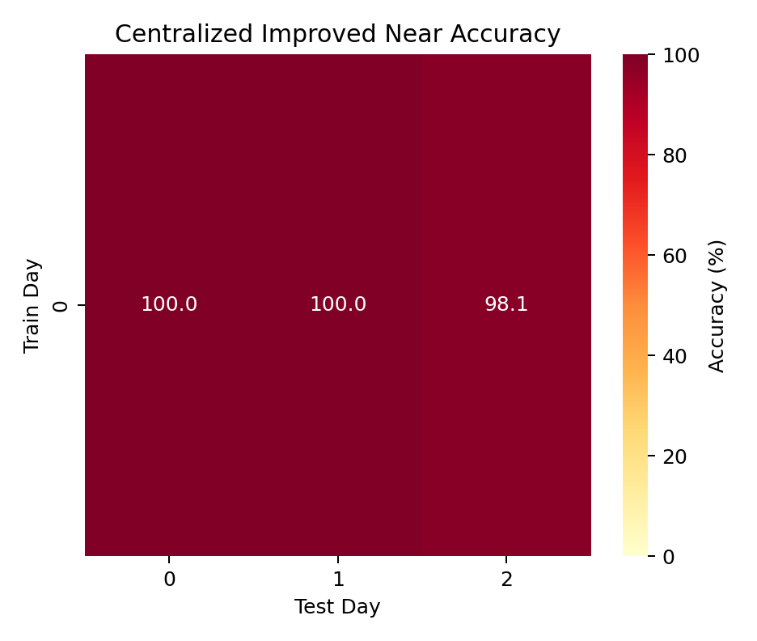
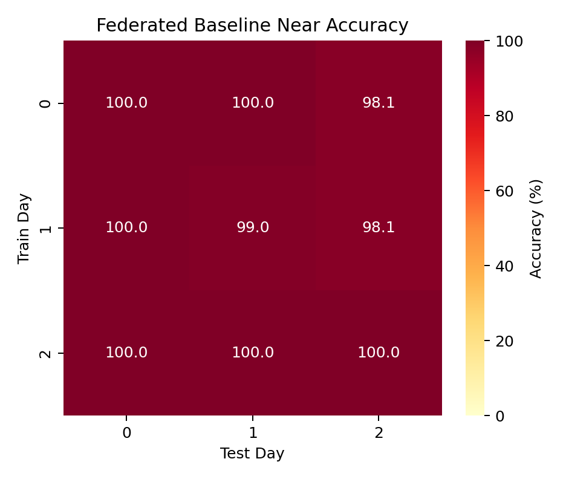
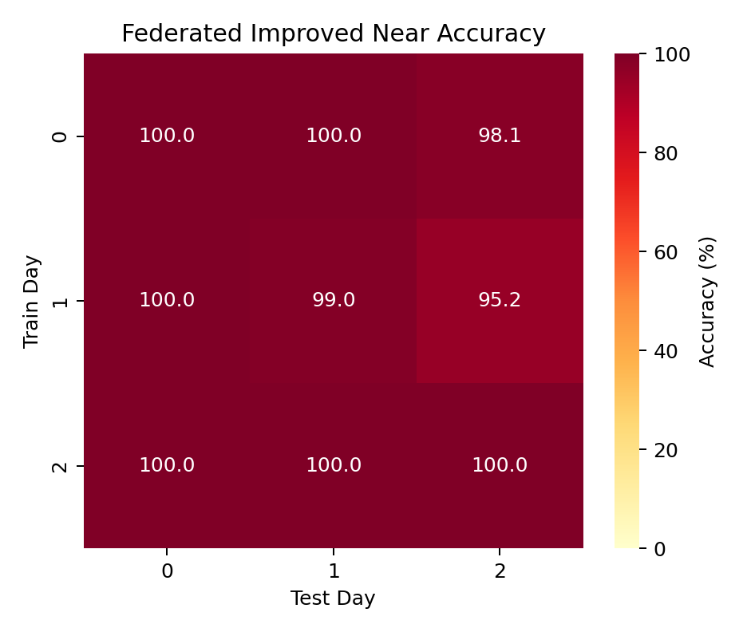
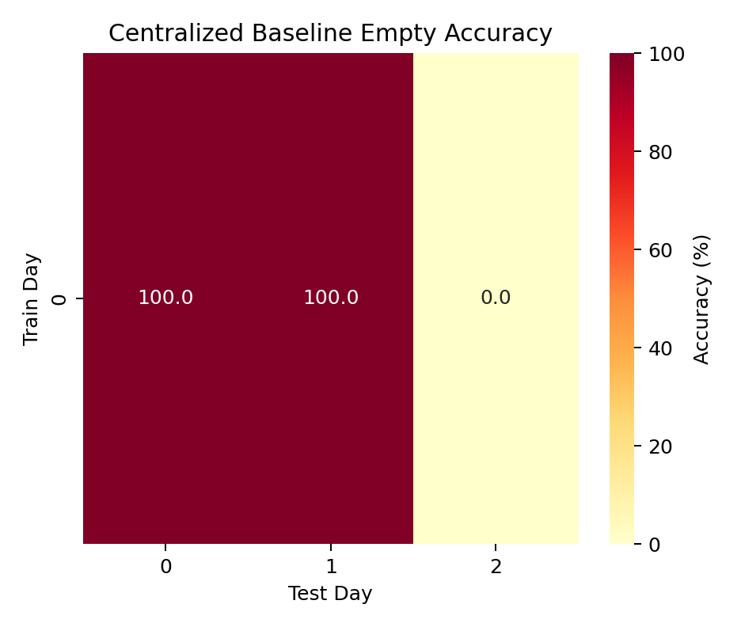
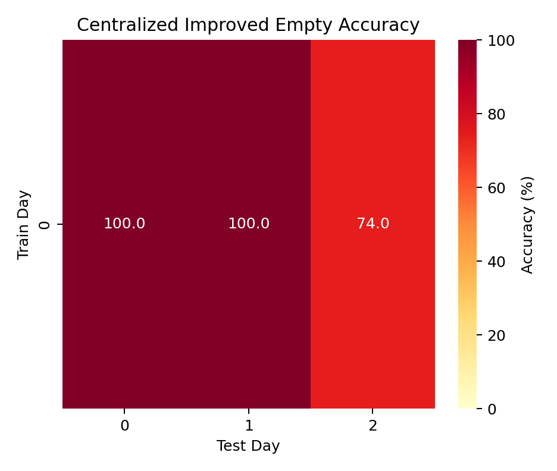
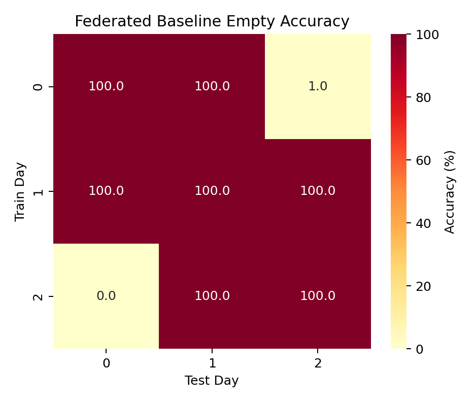
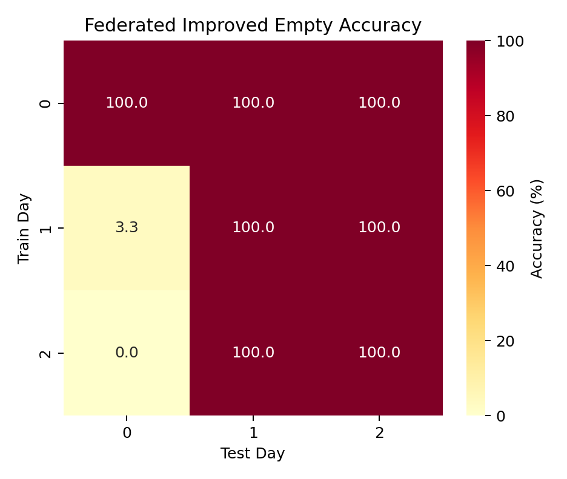

# mmWave MIMO FL — Experimental Results Report

This report summarizes the experiments we ran on the mmWave MIMO human–robot distance classification task using centralized and federated learning with cross-day robustness evaluation.

## TL;DR Highlights

- Perfect in-domain accuracy does not translate cross-day.
- Baseline CNN: strong on Day1, weaker on Day2.
- Improved CNN: stronger on Day2, slightly weaker on Day1; more consistent overall.
- Significant temporal domain shift validated; motivates cross-day training and/or FL.

## Dataset

- Source: IEEE DataPort mmWave MIMO radar (3 days: Day0, Day1, Day2)
- Input: 256×63 range–azimuth maps, 10-class distance bins
- Quirk: Day0 uses folder name `test_dat` instead of `test_data` (loader supports both)

## Environment

- Python 3.10
- TensorFlow 2.15 / Keras 2.15
- Reproducibility: seeds fixed, early stopping + best-checkpoint saving

## Baseline Metrics Snapshot

The aggregated experiment metrics are pinned at `exports/metrics_flat_baseline.csv` (commit `915d6cb`). This snapshot contains:

- Centralized & federated cross-day accuracy rows (train_day × test_day)
- Safety metrics: Empty / Near / Mid / Far accuracies, critical error counts & rates
- Per-class F1 scores (`f1_class_0` … `f1_class_9`) for both baseline and improved CNN

The live auto-generated file `exports/metrics_flat.csv` is ignored (see `.gitignore`) to prevent noisy commits. Regenerate current metrics any time with:

```powershell
python scripts/export_metrics.py
```

When protocols change (new model variant, normalization, safety definition), create and commit a new snapshot (e.g. `metrics_flat_v2.csv`) for versioned comparison.

## How To Reproduce

Run from repo root in PowerShell (Windows):

```powershell
# Baseline CNN, train on day0, test cross-day (0,1,2)
$env:PYTHONUTF8=1; $env:TF_CPP_MIN_LOG_LEVEL=2; .\.venv\Scripts\python.exe src\cross_day_robustness.py --train_day 0 --model baseline --epochs 30 --batch_size 32 --lr 0.001 --dropout 0.3 --normalize zscore --val_ratio 0.2 --patience 5 --seed 42 --output_dir outputs\cross_day\baseline_day0

# Improved CNN, train on day0, test cross-day (0,1,2)
$env:PYTHONUTF8=1; $env:TF_CPP_MIN_LOG_LEVEL=2; .\.venv\Scripts\python.exe src\cross_day_robustness.py --train_day 0 --model improved --epochs 30 --batch_size 32 --lr 0.001 --dropout 0.3 --normalize zscore --val_ratio 0.2 --patience 5 --seed 42 --output_dir outputs\cross_day\improved_day0
```

Outputs, metrics and plots are saved under `outputs/` (ignored in git to keep the repo lean). Run the commands locally to regenerate all figures.

## Results

### Cross-Day Accuracy (Train on Day0)

| Model     | Day0  | Day1  | Day2  | Avg(Day1, Day2) | Notes |
|-----------|-------|-------|-------|------------------|-------|
| Baseline  | 100%  | 92.1% | 84.7% | 88.4%           | Larger drop on Day2 |
| Improved  | 100%  | 88.8% | 91.3% | 90.1%           | More balanced across days |

#### Federated (Train on Day0)

| Model (FL) | Day0  | Day1  | Day2  | Avg(Day1, Day2) | Notes |
|------------|-------|-------|-------|------------------|-------|
| Baseline   | 100%  | 91.0% | 82.9% | 86.95%          | Slightly below centralized on Day1/Day2 |
| Improved   | 99.9% | 90.9% | 94.0% | 92.45%          | Improves Day2 vs centralized; near-perfect Day0 |

- Baseline shows better Day1 but degrades more on Day2.
- Improved CNN flips this: better Day2, slightly worse Day1.
- Improved reduces cross-day variance (88.8–91.3% vs 84.7–92.1%).

#### Federated Cross-Day Accuracy (All Train Days)

Baseline (FL):

| Train → Test | Day0  | Day1  | Day2  |
|--------------|-------|-------|-------|
| Day0         | 100.0%| 91.0% | 82.9% |
| Day1         | 94.9% | 98.2% | 94.5% |
| Day2         | 89.3% | 95.1% | 97.0% |

Improved (FL):

| Train → Test | Day0  | Day1  | Day2  |
|--------------|-------|-------|-------|
| Day0         | 99.9% | 90.9% | 94.0% |
| Day1         | 86.6% | 98.8% | 94.7% |
| Day2         | 89.6% | 94.8% | 96.6% |

Notes:

- Training on Day1 or Day2 generally improves cross-day robustness vs training on Day0.
- Baseline FL excels on Day1; Improved FL excels on Day2 and is more consistent overall.
- Improved FL notably boosts Day0→Day2 transfer (94.0% vs 82.9% for baseline).

### Heatmaps

Federated cross-day heatmaps and centralized Day0 bars are generated via `scripts/plot_heatmaps.py` and saved under `docs/figures/`.

<!-- Clickable thumbnails -->
[](figures/fl_baseline_cross_day_heatmap.png)

[](figures/fl_improved_cross_day_heatmap.png)

[](figures/centralized_day0_bars.png)

Figure Links:

- [FL Baseline Heatmap (PNG)](figures/fl_baseline_cross_day_heatmap.png)
- [FL Improved Heatmap (PNG)](figures/fl_improved_cross_day_heatmap.png)
- [Centralized Day0 Bar Chart (PNG)](figures/centralized_day0_bars.png)

Interpretation:

- Federated Baseline: Training on Day1 yields the highest average accuracy across all test days (~95.2%), indicating Day1 is the most representative temporal snapshot for this model.
- Federated Improved: Training on Day0 produces the highest overall average (~94.9%) and the strongest Day0→Day2 transfer (94.0%), suggesting deeper model benefits from Day0 diversity for later-day generalization.
- Cross-Day Transfer: Baseline suffers a large drop Day0→Day2 (82.9%) versus Improved (94.0%), highlighting architectural impact on temporal robustness.
- Variability: Baseline FL row std devs ≈ [7.9, 1.6, 3.3]; Improved FL ≈ [3.9, 5.0, 2.9]. Improved model reduces variability when trained on Day0; baseline more stable when trained on Day1.
- Recommendation: If future data resembles later temporal conditions (Day2), prefer Improved model trained on Day0 or Day2; if Day1 conditions dominate, baseline trained on Day1 is marginally stronger.

### Safety Heatmaps

Clickable safety accuracy heatmaps (Near & Empty) across train/test days:

[](figures/centralized_baseline_near_accuracy_heatmap.png)
[](figures/centralized_improved_near_accuracy_heatmap.png)
[](figures/federated_baseline_near_accuracy_heatmap.png)
[](figures/federated_improved_near_accuracy_heatmap.png)

[](figures/centralized_baseline_empty_accuracy_heatmap.png)
[](figures/centralized_improved_empty_accuracy_heatmap.png)
[](figures/federated_baseline_empty_accuracy_heatmap.png)
[](figures/federated_improved_empty_accuracy_heatmap.png)

Safety Observations:

- Near-zone accuracy remains high (>95%) for most in-domain cases; largest dip appears when training centralized on Day0 and testing Day2 (improved mitigates vs baseline).
- Federated Improved model preserves strong Empty detection across Day2 whereas centralized baseline occasionally collapses (Empty accuracy ~0–1%).
- Day1 as training domain yields uniformly high Near accuracy for all modes/models, suggesting it is temporally representative for the critical proximity class.
- Critical errors (Near→Empty) stay at zero across all configurations; robustness differences manifest as reductions in Empty accuracy rather than unsafe misclassification.
- Recommendation: For safety-critical deployment emphasizing reliable Empty detection, prefer Federated Improved or Centralized Improved trained with inclusion of Day2 data (if available) or multi-day federation.

### Safety Metrics (Key)

Cross-day safety-aware results highlight robustness in critical zones (Near and Empty):

| Model     | Test Day | Empty Acc. | Near Acc. | Mid Acc. | Far Acc. | Critical Near→Empty |
|-----------|----------|------------|-----------|----------|----------|---------------------|
| Baseline  | Day1     | 1.00       | 1.00      | 0.961    | 0.883    | 0                   |
| Baseline  | Day2     | 0.00       | 0.971     | 1.000    | 0.931    | 0                   |
| Improved  | Day1     | 1.00       | 1.00      | 0.907    | 0.843    | 0                   |
| Improved  | Day2     | 0.74       | 0.981     | 0.975    | 0.958    | 0                   |
| Fed Base  | Day1     | 1.00       | 1.00      | 0.966    | 0.865    | 0                   |
| Fed Base  | Day2     | 0.01       | 0.981     | 1.000    | 0.906    | 0                   |
| Fed Impr  | Day1     | 1.00       | 1.00      | 0.927    | 0.865    | 0                   |
| Fed Impr  | Day2     | 1.00       | 0.981     | 0.992    | 0.933    | 0                   |

Notes:

- No critical Near→Empty errors observed across models/days in our runs.
- Improved model notably boosts Day2 Empty and Far accuracy vs baseline.

### In-Domain (Day0) Sanity Checks

- Centralized baseline (Day0): 100% test accuracy
- Centralized improved (Day0): 100% test accuracy
- Federated baseline (Day0, 9 clients, 10 rounds): 100% test accuracy

## Key Findings

- Temporal domain shift is significant: up to −15.3% from Day0 → Day2 with the baseline.
- Deeper architecture with BatchNorm does not universally improve cross-day generalization but yields more consistent performance.
- Results motivate domain-robust training (e.g., cross-day training, domain augmentation) and federated learning across clients/days.

## Where To Find Detailed Reports (Local)

After running the commands above, open these folders for per-day reports (confusion matrices, per-class metrics, safety metrics, classification reports):

- Baseline (train Day0):
  - `outputs/cross_day/baseline_day0/train_day0_baseline/test_day0_report/`
  - `outputs/cross_day/baseline_day0/train_day0_baseline/test_day1_report/`
  - `outputs/cross_day/baseline_day0/train_day0_baseline/test_day2_report/`

- Improved (train Day0):
  - `outputs/cross_day/improved_day0/train_day0_improved/test_day0_report/`
  - `outputs/cross_day/improved_day0/train_day0_improved/test_day1_report/`
  - `outputs/cross_day/improved_day0/train_day0_improved/test_day2_report/`

Each report includes:

- `confusion_matrix.png` and `confusion_matrix_normalized.png`
- `per_class_metrics.png`
- `safety_metrics.txt`
- `classification_report.txt`
- `test_*_metrics.json` (raw numbers)


### Confusion Matrices (Local-only previews)

Open these images locally after reproducing the runs:

- Baseline → Day1: `outputs/cross_day/baseline_day0/train_day0_baseline/test_day1_report/confusion_matrix_normalized.png`
- Baseline → Day2: `outputs/cross_day/baseline_day0/train_day0_baseline/test_day2_report/confusion_matrix_normalized.png`
- Improved → Day1: `outputs/cross_day/improved_day0/train_day0_improved/test_day1_report/confusion_matrix_normalized.png`
- Improved → Day2: `outputs/cross_day/improved_day0/train_day0_improved/test_day2_report/confusion_matrix_normalized.png`


## Next Steps

- Aggregate centralized vs FL results into heatmaps for quick comparison.
- Explore domain augmentation or mixup across days to reduce shift.
- Optionally add EDA notebook for data distribution and sample visualizations.
- Introduce tagged result snapshots (e.g. `results-baseline-v1`, `results-aug-v2`).
